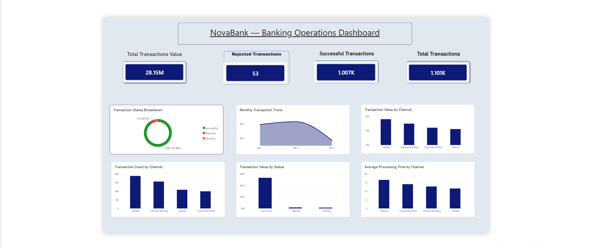
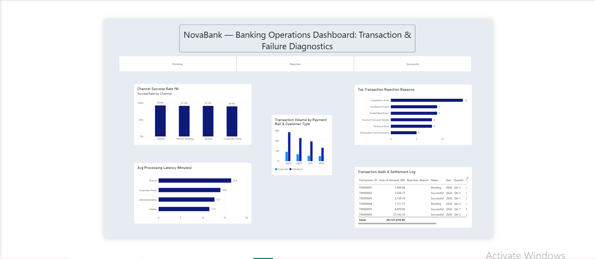

# NovaBank — Banking Operations & Transaction Performance Dashboard

An interactive Power BI dashboard designed to analyze banking transaction performance, operational efficiency, transaction outcomes, and rejection patterns across multiple payment channels.

## 📊 Project Overview

This project analyzes **1,101 banking transactions** with a total transaction value of approximately **₹28.15M**.

The dashboard provides insights into:

- Transaction volume and value
- Successful, rejected, and pending transactions
- Transaction types and payment channels
- Processing-time performance
- Rejection patterns
- Branch and city activity
- Operational performance

## 🛠️ Tools & Technologies

- **Excel** — Data cleaning, validation, and preparation
- **SQL** — Data querying and analysis
- **Power BI** — Dashboard development and visualization
- **DAX** — KPI calculations and analytical measures

## 📈 Dashboard Pages

### 1. Overview Dashboard

Provides a high-level view of:

- Total transactions
- Total transaction value
- Transaction success rate
- Transaction trends
- Transaction status
- Payment channels
- Transaction types



### 2. Transaction Diagnostics

Provides a detailed view of:

- Transaction outcomes
- Processing-time performance
- Rejection patterns
- Operational performance
- Transaction-level diagnostics



## 🔑 Key Metrics

| Metric | Value |
|---|---:|
| Total Transactions | 1,101 |
| Total Transaction Value | ₹28.15M+ |
| Successful Transactions | 1,007 |
| Rejected Transactions | 53 |
| Pending Transactions | 41 |
| Success Rate | 91.46% |

## 💡 Key Insights

- **Mobile** was the largest transaction channel with **376 transactions**.
- **IMPS** was the most frequently used transaction type with **377 transactions**.
- **Mumbai** recorded the highest transaction volume with **329 transactions**.
- **1,007 transactions** were successful, resulting in a **91.46% success rate**.
- **53 transactions** were rejected, representing approximately **4.81%** of total transactions.
- **41 transactions** were pending, representing approximately **3.72%** of total transactions.

## 🎯 Skills Demonstrated

- Data cleaning and validation
- Excel data preparation
- SQL data analysis
- Power BI dashboard development
- DAX calculations
- KPI design
- Data visualization
- Banking operations analysis
- Operational performance analysis
- Transaction analysis

## 📁 Project Structure

```text
NovaBank-Banking-Operations-Dashboard/
│
├── 
├── 
└── README.md


